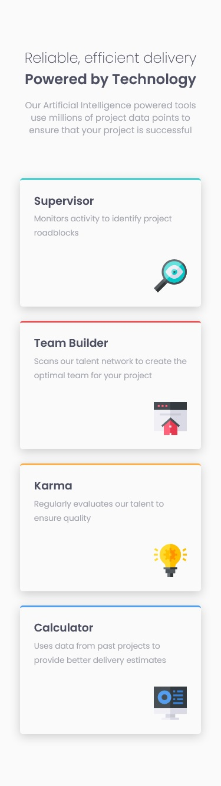
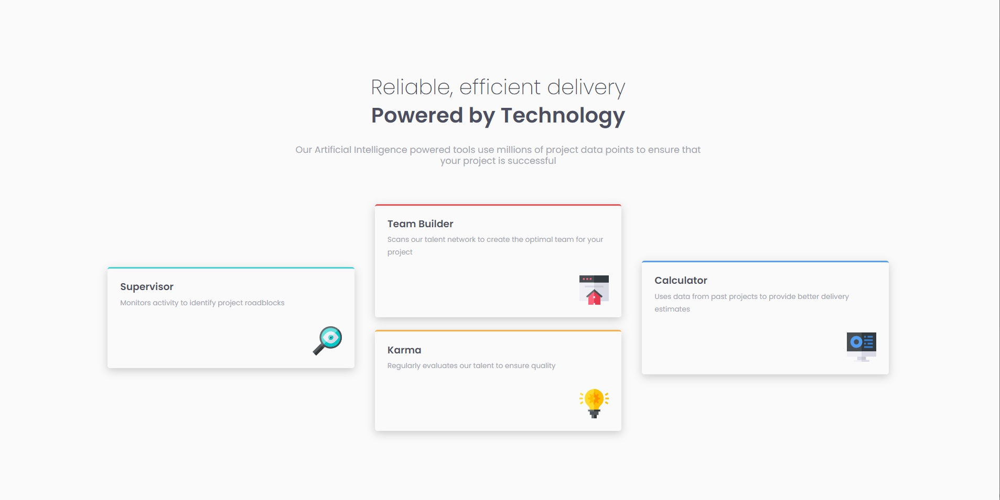

# Frontend Mentor - Four card feature section solution

This is a solution to the [Four card feature section challenge on Frontend Mentor](https://www.frontendmentor.io/challenges/four-card-feature-section-weK1eFYK). Frontend Mentor challenges help you improve your coding skills by building realistic projects. 

## Table of contents

- [Overview](#overview)
  - [The challenge](#the-challenge)
  - [Screenshot](#screenshot)
  - [Links](#links)
- [My process](#my-process)
  - [Built with](#built-with)
  - [What I learned](#what-i-learned)
  - [Continued development](#continued-development)
- [Author](#author)

## Overview

### The challenge

Users should be able to:

- View the optimal layout for the site depending on their device's screen size

### Screenshot

### Links

- Solution URL: [https://github.com/GSD3v08/four-card-feature-section](https://github.com/GSD3v08/four-card-feature-section)
- Live Site URL: [https://gsd3v08.github.io/four-card-feature-section/](https://gsd3v08.github.io/four-card-feature-section/)

## My process

### Built with

- Semantic HTML5 markup
- CSS custom properties
- Flexbox
- Mobile-first workflow

### What I learned

In this challenge I learn how to use ">" selector to pick only direct card children of cards container.

### Continued development

Learn more about pseudo elements and pseudo classes, keep using flexbox and responsive design.

## Author

- Frontend Mentor - [@GSD3v08](https://www.frontendmentor.io/profile/GSD3v08)

